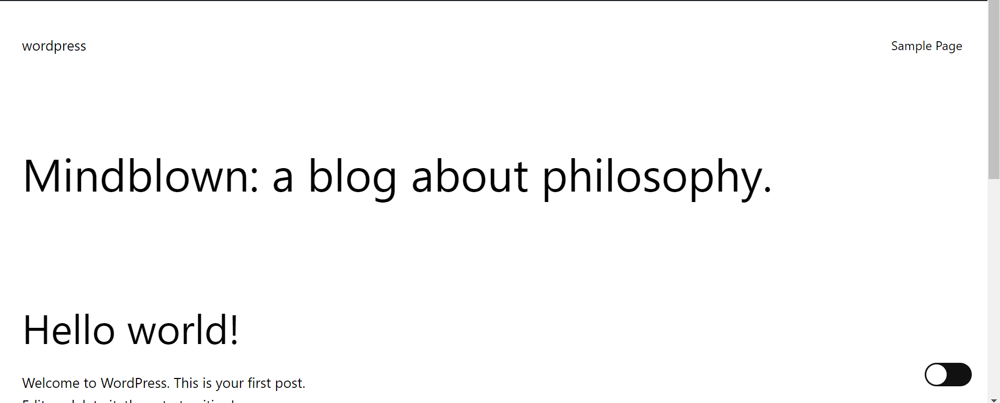
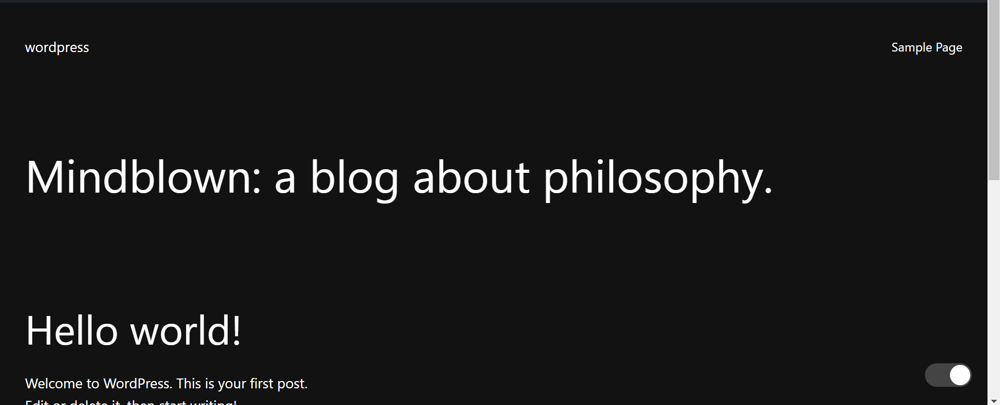

# WordPress Dark Mode Plugin

## Description

The WordPress Dark Mode Plugin allows you to easily add a dark mode toggle to the front end of your WordPress site. With a sleek, responsive toggle button, users can switch between light and dark modes, enhancing their browsing experience, especially in low-light environments. The plugin dynamically adjusts the background and text colors to ensure readability and provides a smooth transition between modes. It also remembers the user's preference using `localStorage`, so the site opens in their preferred mode on subsequent visits.

## Features

- **Easy Integration**: Seamlessly adds a dark mode toggle to your WordPress site with minimal configuration.
- **Beautiful Toggle Button**: A stylish, animated toggle switch positioned in the bottom right corner.
- **Dynamic Color Adjustments**: Automatically adjusts the background and text colors to maintain readability in dark mode.
- **Persistent Preferences**: Remembers the user's dark mode preference using `localStorage`.
- **Lightweight and Fast**: The plugin is optimized for performance, ensuring it doesn't slow down your site.

## Installation

1. **Download the Plugin**: Download the plugin files from this repository.
2. **Upload to WordPress**: In your WordPress dashboard, navigate to `Plugins > Add New` and upload the plugin ZIP file.
3. **Activate the Plugin**: After uploading, click "Activate" to enable the Dark Mode plugin.
4. **Customize if Needed**: Modify the CSS or JavaScript files if you want to customize the behavior or appearance further.

## Usage

Once the plugin is activated:
- A dark mode toggle button will appear on the bottom right of your website.
- Users can switch between light and dark modes by clicking the toggle.
- The plugin will remember the user's preference, ensuring a consistent experience on future visits.

### Example

Here's how your website might look with the dark mode enabled:

## Contributing

Contributions are welcome! If you have suggestions or improvements, feel free to open an issue or submit a pull request.

1. Fork the repository.
2. Create a new branch for your feature or bugfix.
3. Commit your changes.
4. Push the branch and submit a pull request.

## License

This project is licensed under the MIT License. See the `LICENSE` file for more details.

## Contact

For any questions or support, feel free to contact me at [https://github.com/shahidasghar90].

